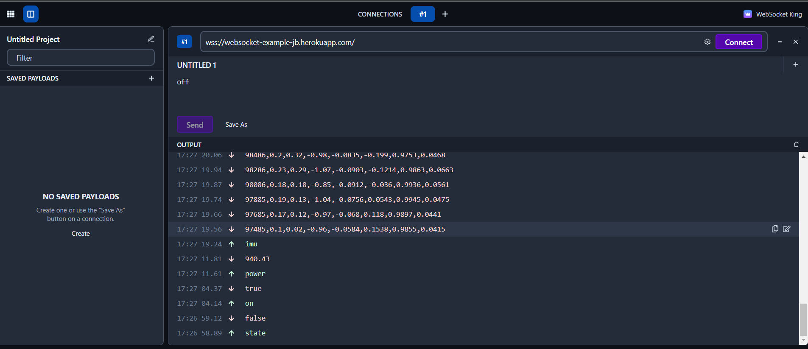

# WebSocket Example

WebSocket is a computer communications protocol, providing full-duplex communication channels over a single TCP connection.

In this example I have set up a WebSocket server and client that accepts commands to get readings from an IMU (Inertial Measurement Unit). The server is not actually connected to an IMU (this is just an example application), instead it reads data that was taken from a real IMU and stored in a database (this is handled by the seeds.js script).

You can use a client such as https://websocketking.com/ to access the WebSocket server or use your own WS connection and connect to wss://websocket-example-jb.herokuapp.com/ on port 3000.

The WebSocket accepts the following commands:

1) power: Sends the current power of the IMU reading.
2) on: Turns on the IMU connection.
3) off: Turns off the IMU connection.
4) state: Gets the state of the IMU connection.
5) imu: Gets a continuous stream of IMU readings.

See how the connection works: 

I have used this as a test connection for other projects:

1) IoT Control Panel: https://github.com/javierb07/iot-control-panel
2) IoT IMU in Unity: https://github.com/javierb07/iot-imu-unity
